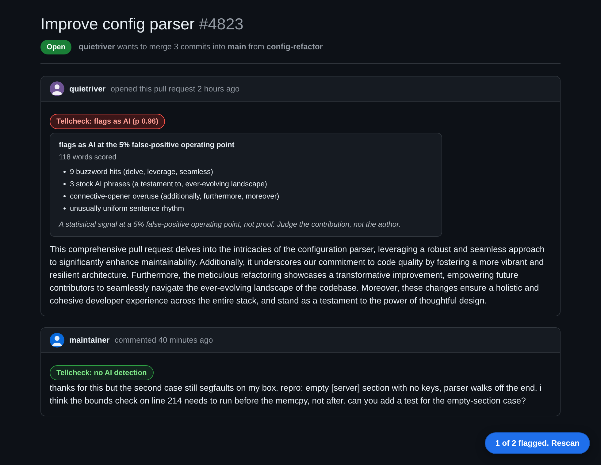
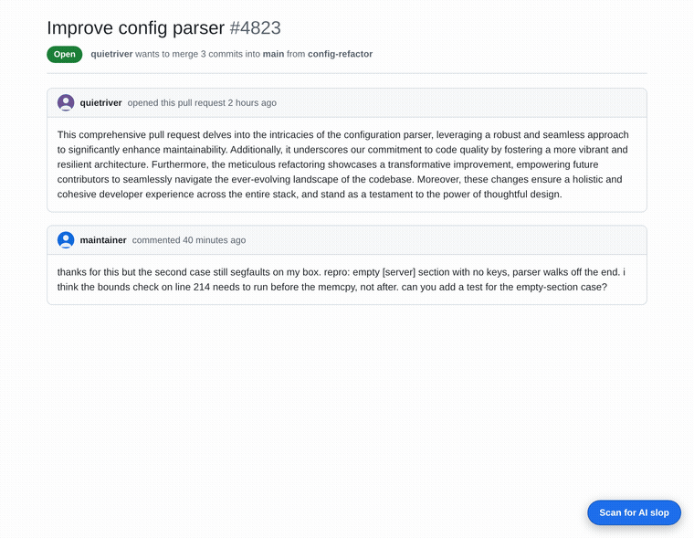

# Tellcheck for GitHub

**Reads the pull request before you do, and tells you how much of it sounds like a language model wrote it.**

[](https://github.com/munzzyy/tellcheck-github/actions/workflows/ci.yml)
[](https://addons.mozilla.org/en-US/firefox/addon/tellcheck-for-github/)
[](LICENSE)

> **Install:** [addons.mozilla.org](https://addons.mozilla.org/en-US/firefox/addon/tellcheck-for-github/).
> Free, no account, 100 scored comments a day.



Click scan on any pull request or issue. Every comment gets a badge, and every badge opens
to show the actual signals behind it: which buzzwords fired, which stock phrases, how
uniform the sentence lengths are. On a repo's pull request list you can scan up to 25 open
PRs at once.



## Why this exists

Codeberg, Godot, OpenJDK, Rust and Ghostty all restricted AI-generated contributions during
2026. Whichever way a project lands on it, enforcing the decision still means a human reads
every submission and forms a private opinion about who wrote it. This does the first read
and shows its work.

It is a triage tool. Nobody can prove authorship of text after the fact, including this,
and a maintainer who treats a red badge as a verdict will eventually accuse a real person
of something they did not do.

## What it actually claims

Detectors get sold on a single accuracy number that falls apart the moment the text is not
from the generator they tuned on. Here is the whole picture instead, measured on held-out
sets:

| Held-out set | What it is | AUROC | Catch rate at 5% FPR |
|---|---|---|---|
| DetectRL-X | 2025-era generators (DeepSeek-V3 and similar), plus paraphrase and zero-width-space attacks | 0.983 | 92% |
| RAID-test | 2022-23 generators (GPT-2/3, Cohere, MPT, Mistral) | 0.89 | 67% |
| MAGE (paraphrase) | GPT text run through a paraphraser, out of domain | 0.81 | 39% |
| humanizer-attack | Ghostbuster "undetectable" essays | | 99% caught |

The number that matters most is the one that goes the other way. On 4,300 held-out essays
by non-native English speakers, real writing by real people, **7.8% come back flagged**.
That is the honest ceiling on trusting any single result, and it is why the advice never
changes: judge the contribution, not the author.

The threshold targets a 5% false-positive rate across a broad mix of English. Under roughly
twenty words, or on text it reads as anything other than English, it does not guess at all.
It says it abstained and tells you why. A one-line "lgtm" gets no verdict, because no
honest detector can give one. The [measurement page](https://tellcheck.munzzyy.dev/eval)
carries the corpus, the calibration and the named failure modes.

## What leaves your browser

Nothing, until you click scan. Then the visible text of that PR or issue goes over HTTPS to
the scoring worker with code blocks stripped, plus a random id that counts your daily
scans and rotates every day. The text is scored in memory and dropped. It is not stored,
not logged in full, and not tied to your GitHub account.

The extension asks for one permission, `storage`, and runs on `github.com` only. If you add
a GitHub token to raise the batch-scan rate limit, it stays on your device and is sent only
to `api.github.com`. The [privacy policy](https://tellcheck.munzzyy.dev/privacy) is the
long version, and the code that backs it is in this repo.

## Layout

```
extension/          the MV3 extension, Firefox first
  content/          the scan button, badges and signal panels on github.com
  background.js     every network call lives here
  popup/ options/   quota, CSV export, settings
worker/             the scoring API on Cloudflare Workers
  src/index.js      POST /score, metered per install and per IP in a Durable Object
  src/comment-tells.js  the comment-style layer, a separate genre signal with parity fixtures
site/               the landing page, measurement page and privacy policy
test/               worker suite and a headless DOM smoke test
```

## Development

```
python3 tools/sync_detector.py        # pull the private detector into the worker
node --test test/worker.test.mjs      # 13 tests that need the detector, no network
node --import ./test/stub-detector.mjs --test test/worker-meter.test.mjs
                                      # 18 meter, request-cap and style-copy tests; without
                                      # the detector they run against test/detector-stub.mjs
node --test test/comment-tells.test.mjs  # comment-style layer vs the Python original; the synthetic
                                         # fixtures always run, the full corpus set runs when found
                                         # locally (see test/comment-fixtures.mjs)
node --test test/style-copy.test.mjs  # style reasons read for the maintainer, not the drafter
node --test test/background.test.mjs  # request splitting and quota handling, stub worker
python3 test/content_smoke.py         # drives the real content script in headless chromium
python3 test/popup_smoke.py           # the popup's quota line for each stored quota state
bash tools/package.sh                 # lint, then build dist/ only if the lint passes
```

To try a build: Firefox, `about:debugging`, This Firefox, Load Temporary Add-on, pick
`extension/manifest.json`.

Deploying the worker needs a Cloudflare account:

```
cd worker
wrangler kv namespace create QUOTA    # paste the printed id into wrangler.toml
wrangler deploy
```

Then put the live URL in `extension/config.js` if it differs from the default.

## What is not in this repository

The detector. `worker/src/detector-core.js` is synced in at build time from a private
engine and is gitignored, so the scoring tests do not run in CI here either. The meter and
request-cap tests do, against a stub that stands in for the detector. Everything
about how that engine is called, metered, rate limited and rendered is in this repo, which
is the point of the privacy policy telling you to read the code. The claims about what the
server does with your text are checkable. The model is not open.

## The one rule

Every score says signal, not proof. Do not weaken that framing anywhere in the UI. A false
accusation costs a contributor far more than a missed bot costs a maintainer.

## License

[GPL-3.0-or-later](LICENSE). You can use, study, change and share it. If you distribute a copy
or a modified version, it has to stay under the GPL and come with its source. Earlier commits
were under MIT.
